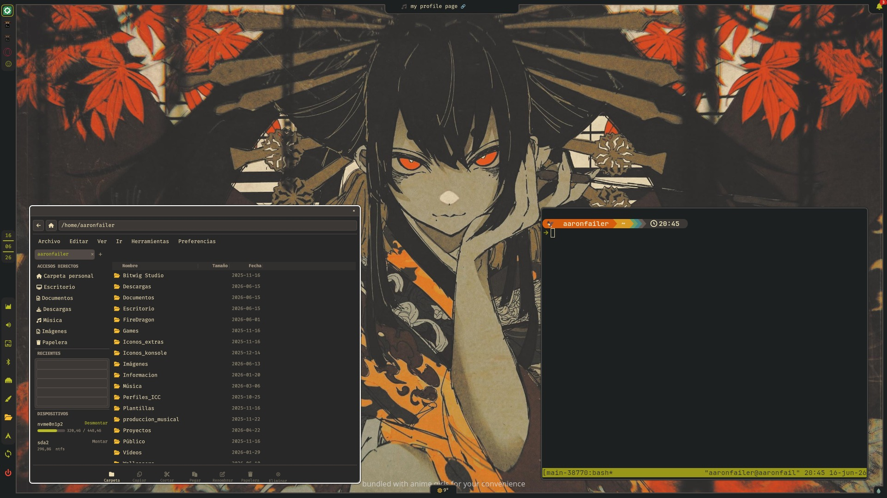
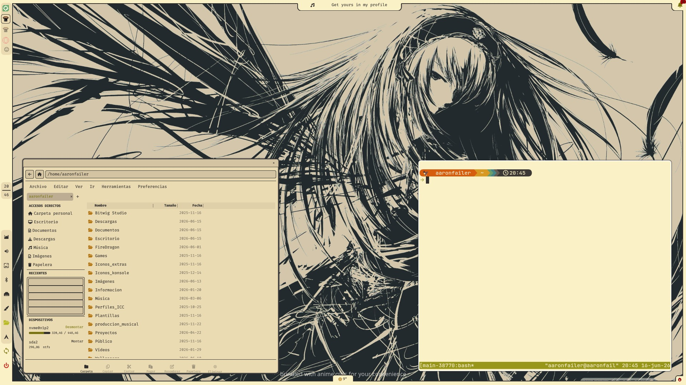

# Gruv-Lidia

Shell minimalista para **Hyprland** construido con **Quickshell**, basado en los colores Gruvbox.




## Widgets incluidos

| Widget | Descripción |
|---|---|
| **Power Panel** | Apagar, reiniciar, suspender o cerrar sesión (con guardado automático de ventanas) |
| **Update Panel** | Actualizar sistema completo, actualizar mirrors y limpiar basura del PC con un clic |
| **Menu** | Programas recientes, barra de búsqueda por rutas específicas (Documentos, Descargas, Imágenes, etc.) y buscador de programas |
| **File Manager** | Explorador de archivos propio del theme, creado desde scripts Python + QML con ayuda de Quickshell |
| **Color Editor** | Personalización de colores para ambos themes (oscuro y claro) |
| **Internet** | Gestión de Wi-Fi/Ethernet con contador de datos en vivo |
| **Bluetooth** | Conexión con cualquier dispositivo Bluetooth |
| **Wallpaper** | Cambiador de wallpapers según la ruta establecida; los wallpapers en esa ruta pueden cambiarse rápidamente desde el widget |
| **Volume** | Control de volumen general, selección de entradas y salidas de audio |
| **Clock & Calendar** | Widget de hora y fecha que cambia automáticamente cada ciertos segundos, con calendario incluido |
| **Task Manager** | Ocultar/minimizar aplicaciones y traerlas al frente de nuevo |
| **Media Player** | Reproducción multimedia: subir/bajar volumen del programa específico, pausar, siguiente/anterior |
| **Notifications** | Centro de notificaciones |
| **Weather** | Clima actual, ícono clickeable para ver pronóstico extendido |
| **Theme Switcher** | Cambia entre tema oscuro y claro con animación circular (ícono fuego/agua en esquina inferior derecha) |
| **Screen Recorder** | Grabación de pantalla con selector de área. Inicia/para con `SUPER+R` o click en el indicador rojo |

## Scripts

| Script | Función |
|---|---|
| `save-session.sh` | Guarda todas las ventanas abiertas con su workspace, posición, tamaño y sesiones tmux |
| `restore-session.sh` | Restaura todas las ventanas al iniciar sesión |
| `clipboard-persist.sh` | Portapapeles persistente: mantiene lo copiado incluso después de cerrar la app (Wayland + X11) |
| `clean-system.sh` | Limpieza segura del sistema (pacman, paru, flatpak, thumbnails viejos) sin borrar archivos de estado |
| `update-system.sh` | Actualización completa del sistema |
| `update-mirrors.sh` | Actualización de mirrors |
| `file-browse.py` | Backend del explorador de archivos |
| `set-wallpaper.sh` | Cambia el wallpaper de Hyprpaper |
| `swap-kitty-theme.sh` | Cambia entre tema oscuro y claro en Kitty |
| `fetch-weather.sh` | Obtiene datos del clima |
| `art-bridge.sh` | Bridge para arte de MPRIS |
| `screen-record.sh` | Grabación de pantalla con `slurp` + `wf-recorder` (selector de área) |
| `notif-monitor.py` | Monitor de notificaciones |
| `tray-procs.py` / `tray-procs.sh` | Backend de la bandeja del sistema |

## Requisitos

- **Arch Linux** (o derivado con `pacman` + `paru`/`yay`)
- **Hyprland**
- **Wayland**

## Instalación

```bash
git clone https://github.com/aaronfailer/gruv-lidia.git
cd gruv-lidia
./install.sh
```

El instalador:
1. Instala todos los paquetes necesarios (incluyendo Quickshell y dependencias desde AUR)
2. Despliega configuraciones de Hyprland, Kitty, Fuzzel, Swaync, Starship y Tmux
3. Configura guardado y restauración de sesión
4. Habilita persistencia de portapapeles para Wayland y X11
5. Agrega atajos y configuración al `~/.bashrc`
6. Crea un enlace simbólico del repositorio a `~/.config/quickshell/`
7. Habilita el servicio systemd de guardado de sesión
8. Configura soporte para Plasma KDE (autostart y shutdown hook)

> **Importante:** Cerrá sesión y volvé a entrar después de instalar (o ejecutá `hyprctl reload`).

## Personalización

### Temas
El theme cambia entre oscuro y claro haciendo clic en el ícono de la esquina inferior derecha (fuego-agua). Los colores pueden personalizarse desde el **Color Editor** widget.

### Wallpapers
Los wallpapers incluidos son:
- `darktheme.jpg` (tema oscuro)
- `whitetheme.jpg` (tema claro)
- `claro.jpg` (tema claro alternativo)

Para usar tus propios wallpapers, colocá imágenes `.jpg`, `.jpeg`, `.png` o `.webp` en el directorio configurado durante la instalación (por defecto `~/Wallpapers/Wallpaper-imagen/`) y seleccionalos desde el widget de wallpapers.

### Video demo

<video src="screenshots/gruv-lidia-demo.mp4" controls></video>

### Atajos de teclado
Los atajos se configuran en `~/.config/hypr/hyprland.conf`. Los principales:

| Tecla | Acción |
|---|---|
| `SUPER + Enter` | Terminal (Kitty) |
| `SUPER + X` | Cerrar ventana |
| `SUPER + 1-3` | Workspace 1-3 |
| `ALT + Tab` | Minimizar/restaurar ventana |
| `SUPER + R` | Iniciar/detener grabación de pantalla (con selector de área) |
| `Print` | Captura de pantalla (región) |

## Estructura del repositorio

```
gruv-lidia/
├── install.sh                    # Instalador
├── Theme.qml                     # Tema (colores, fuentes, opacidades)
├── shell.qml                     # Entry point de Quickshell
├── qmldir                        # Registro de módulos QML
├── .gitignore
├── LICENSE
├── README.md
│
├── scripts/                      # Scripts del sistema
│   ├── save-session.sh
│   ├── restore-session.sh
│   ├── clipboard-persist.sh
│   ├── clean-system.sh
│   ├── update-system.sh
│   ├── update-mirrors.sh
│   ├── file-browse.py
│   ├── open-with.py
│   ├── set-wallpaper.sh
│   ├── swap-kitty-theme.sh
│   ├── fetch-weather.sh
│   ├── search-location.sh
│   ├── art-bridge.sh
│   ├── screen-record.sh
│   ├── notif-monitor.py
│   ├── tray-procs.py
│   └── tray-procs.sh
│
├── dotfiles/                     # Configuraciones para apps externas
│   ├── hypr/                     # Hyprland
│   │   ├── hyprland.conf
│   │   ├── hyprpaper.conf
│   │   ├── minimize-rescue.py
│   │   └── scripts/
│   ├── kitty/                    # Terminal
│   ├── fuzzel/                   # Lanzador de apps
│   ├── swaync/                   # Centro de notificaciones
│   ├── starship/                 # Prompt del terminal
│   ├── tmux/                     # Terminal multiplexer
│   ├── systemd/                  # Servicio de guardado de sesión
│   ├── autostart/                # Autostart para Plasma
│   ├── plasma-shutdown/          # Shutdown hook para Plasma
│   ├── local-bin/                # Scripts auxiliares
│   └── wallpapers/               # Wallpapers incluidos
│
├── screenshots/                  # Capturas de pantalla
│
├── RecordIndicator.qml            # Indicador de grabación (punto rojo parpadeante)
├── *.qml                         # Widgets QML (40+ archivos)
└── fuzzel-track.sh
```

## Sesión (save/restore)

Al cerrar sesión desde el **Power Panel** (o al apagar/reiniciar el sistema), `save-session.sh` guarda:

- Todas las ventanas abiertas (nativas, flatpaks, wine, AppImages, Steam)
- Workspace, posición y tamaño de cada ventana
- Sesiones de tmux activas

Al iniciar sesión, `restore-session.sh` restaura automáticamente todo.

Para terminales con **tmux**: los plugins `tmux-resurrect` + `tmux-continuum` preservan ventanas, paneles, directorios y procesos en ejecución, guardando automáticamente cada 15 minutos.

## Portapapeles persistente

El script `clipboard-persist.sh` mantiene el portapapeles vivo incluso después de cerrar la aplicación que copió el contenido:

- **Apps Wayland**: `wl-clip-persist` mantiene los datos automáticamente
- **Historial**: `cliphist list \| cliphist decode` para recuperar copiados anteriores

### Session restore no funciona
Revisar los logs:
```bash
cat ~/.cache/session-save.log
cat ~/.cache/session-restore.log
```

### Portapapeles no persiste
Verificar que `wl-clip-persist` esté instalado:
```bash
paru -S wl-clip-persist-git
```

## Licencia

[MIT](LICENSE)
